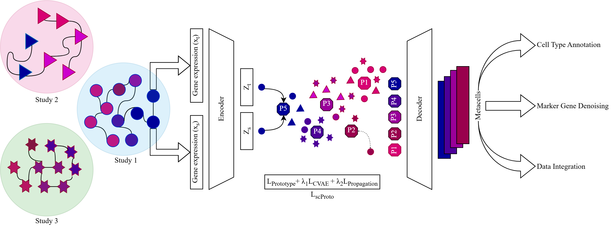

# Interpretable Self-Supervised Prototype Learning for Single-Cell Transcriptomics

**Learn cross-batch metacells** using interpretable self-supervised prototype learning to **denoise** and **preserve biological structure** in single-cell data — without using labels.

📄 [Read the paper (ICLR 2025 - LMRL Workshop)](https://openreview.net/forum?id=mTjWUeyll5&noteId=mTjWUeyll5)

## Overview

Single-cell RNA-seq data is often **noisy**, **sparse**, and affected by **batch effects**, which can obscure meaningful biological insights.  
**scProto** is an interpretable self-supervised prototype learning method that learns biologically meaningful **prototypes** and decodes them into **metacells** — compact, denoised representations of cell populations across batches.

- Learns **cross-batch metacells** that reflect biologically meaningful cell groups  
- Trained to **preserve biological structure** and **cell-cell relationships** in the embedding space while mitigating batch effects  
- Fully **label-free**, requiring no annotations  

## Key Features

- **Interpretable prototype learning** and **metacell decoding** across datasets  
- Embedding space that maintains **biological topology** and **local cell relationships**  
- Enhances single-cell analysis by **denoising gene expression** and **overcoming data sparsity**

## Model Architecture

  

**scProto** builds upon the **CVAE architecture from scPoli**, designed for interpretable reconstruction of gene expression, and combines it with a **self-supervised prototype learning strategy based on SwAV** (Swapped Assignment between Views).

The model is trained end-to-end to learn:

1. **Prototypes** via SwAV-style self-supervised contrastive learning  
2. **Metacell reconstructions** by **decoding prototypes using the CVAE decoder**  
3. **Coverage of rare cell types** via a Propagation loss

This unified design allows the model to **aggregate similar cells**, **preserve cell-cell structure**, and **denoise gene expression**, all while being **fully unsupervised**.

## Method

We use **SwAV**, a self-supervised contrastive clustering method, to learn prototypes that represent transcriptionally similar groups of cells. 

### Key Components:

- **SwAV Loss (per-batch averaged)**  
  Prevents batch-specific prototype collapse by computing prototype assignments **within each batch** and averaging the loss across batches

- **CVAE Decoder (from scPoli)**  
  Ensures that each prototype can be **decoded into a metacell**, preserving biologically relevant expression profiles while supporting interpretability

- **Propagation Loss**  
  A min-max objective to ensure that **rare cell types** are assigned to at least one prototype

Together, these components optimize the composite loss:

$$
L_{\text{scProto}} = L_{\text{batchSwAV}} + \lambda_1 \cdot L_{\text{propagation}} + \lambda_2 \cdot L_{\text{CVAE}}
$$

This enables **scProto** to:

- Learn **interpretable cross-batch prototypes**  
- **Preserve biological structure** in the embedding space  
- **Denoise** sparse gene expression  
- **Improve rare cell type representation**
